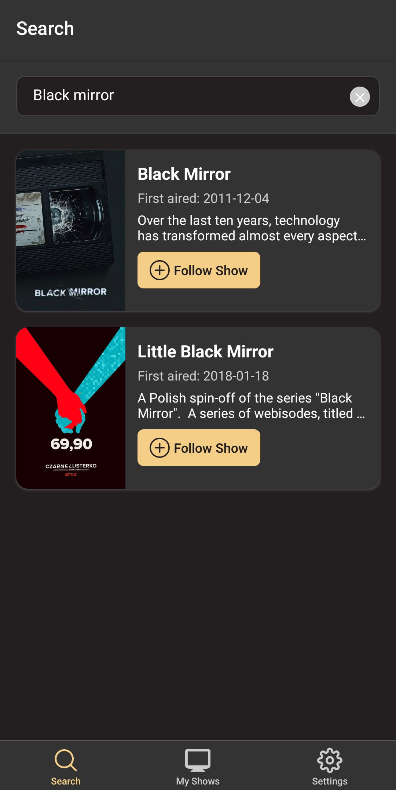
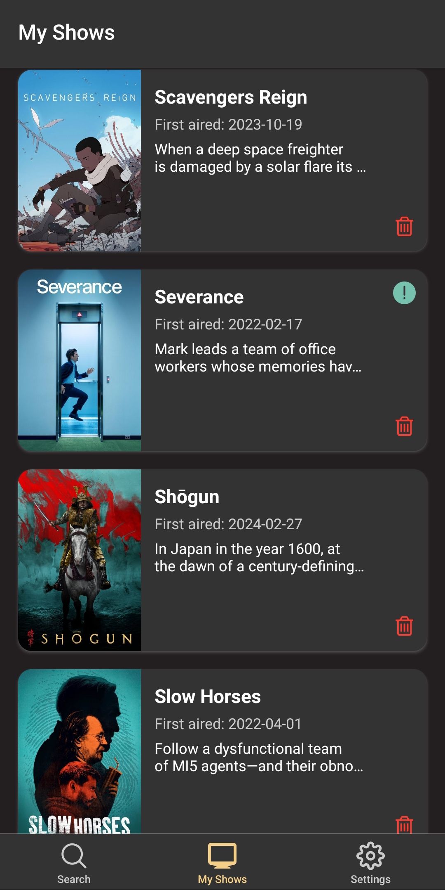
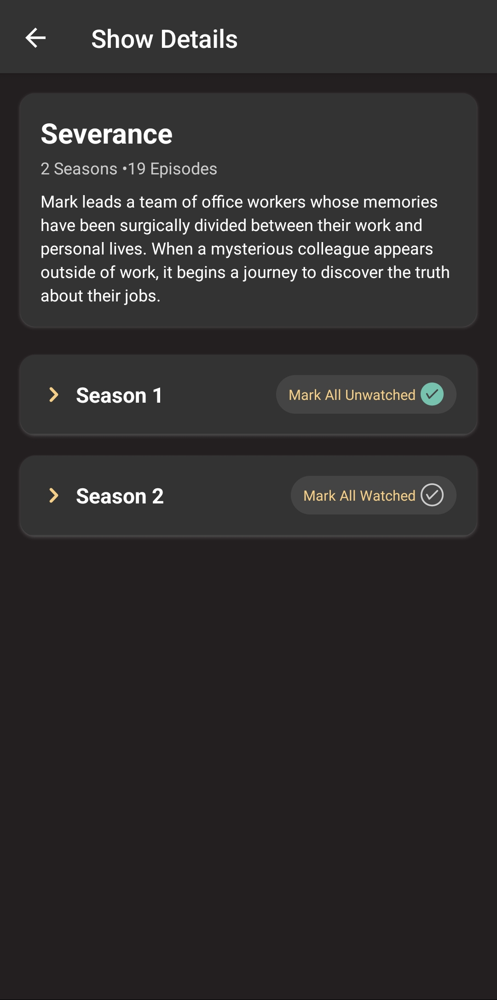
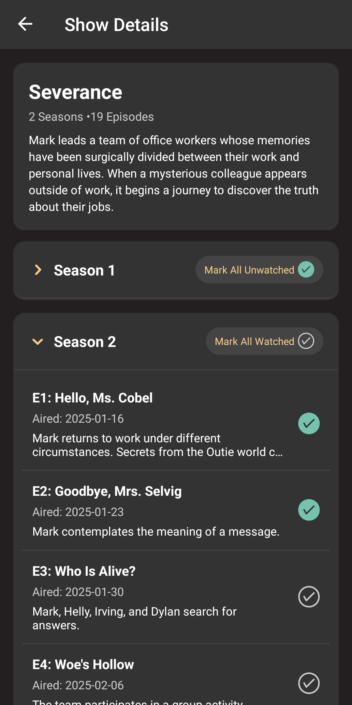

# Binger

A mobile app built with React Native and Expo that helps you track your favorite TV shows.
Search for shows via TMDB's API, follow them to add to your personal collection, and keep track of new episodes.
The app uses local SQLite storage to maintain your data without requiring a backend server.

## Features

- Search for TV shows using The Movie Database (TMDB) API
- Follow/unfollow shows to build your personal collection
- View all your followed shows in one place
- Local data storage using SQLite
- Backup your database in JSON format - export / import feature
- Cross-platform support for iOS and Android

## Tech Stack

- React Native
- Expo Router
- Expo SQLite
- TMDB API
- TypeScript

## Screenshots

Shows can be followed and tracked in My Shows section:

You can mark entire seasons as watched:

You can spread out a season and mark individual episodes:

You can save your data as a JSON file and import it to another device:

